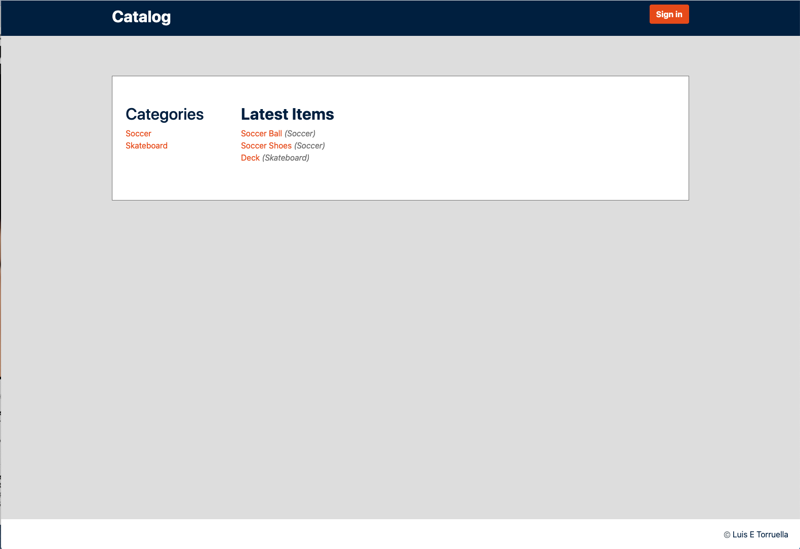

# Catalog APP

This app was part of my fullstack program at Udacity.co
The goal of the app is to handle CRUD and User oauth with google
User will be able to perform CRUD commands if they sign up with their google accounts but with the limitiations of the inputs they add to the database, for example if User A creates item X user B will not be able to manipulate that input.

In the latest version I am updating the app with modern stack and practices. To see the changes look at the [changelog]('change.md') or the `git log --oneline`. A blog and video series explaining how it was made from scratch is on the work. Stay tuned.

# Getting Started

## pre-requisites
 Install Vagrant's latest version fof [Vagrant](https://www.vagrantup.com/) and  [Virtual Box](https://www.virtualbox.org/)   

## Installing
 
 Just clone this repo: `git clone https://github.com/letorruella/catalog-app`

### Setup Server

 Start vagrant `vagrant up`
 
 Shh into it `vagrant ssh`

 ### Setup App
 
 Once that's done install the dependencies: `pip install -r requirements.txt `
 
 Setup the database `python project/models.py` 
 
 Add some data `python project/modelstemplate.py`    
 
 ### Run
 run the app `python run.py`, it should look like this:
 
 

# Tech Stack(all organized in requirements.txt)
Checkout the [Vagrantfile](Vagrantfile) and the [requirements.txt](requirements.txt) for more info

    Vagrant for virtualization
    autopep8 to comply with pep8(not in requirements.txt)
    HTML CSS and JavaScript 
    bleach==2.1.2
    cachetools==2.0.1
    certifi==2018.1.18chardet==3.0.4
    click==6.7
    Flask==0.12.2
    Flask-HTTPAuth==3.2.3
    Flask-SQLAlchemy==2.3.2
    google-auth==1.4.1
    html5lib==1.0.1httplib2==0.10.3idna==2.6itsdangerous==0.24Jinja2==2.10
    MarkupSafe==1.0
    oauth2client==4.1.2
    packaging==16.8
    passlib==1.7.1
    psycopg2==2.7.4
    pyasn1==0.4.2
    pyasn1-modules==0.2.1
    pyparsing==2.2.0
    redis==2.10.6
    requests==2.18.4
    rsa==3.4.2
    six==1.11.0
    SQLAlchemy==1.2.2
    urllib3==1.22
    webencodings==0.5.1
    Werkzeug==0.14.1

# Overview 

The app is organize in very easy to nagivate folders, I looked at how other professionals organize their flask folders structures and applied to my own

* Root folder '/'   
    * .gitgnore you all know what this is 
    * run.py this is basic script that allows you to start the app just type 'python run.py' in the terminal and voila
    * This README.md file that is basically explaining what is happening
    * requirements.txt that has all the libraries that are used to composed the entire aplication
    * the Vagrantfile, this project was built using Vagrant as virtual enviroments to sepparte the libraries from my local pc see https://www.vagrantup.com/ for more information on it, the configuration for this enviroment was provided by Udacity

* project folder '/'
    * static holds the css folders where all the styles are located, nothing special here, oh and a cheesy logo I made for favicon placeholder
    * Holds all the 
    *  -___init__-.py' to make sure all folders are treated as packages
    * models.py creates the database and its relationships
    * modelstemplate.py has a couple dummy descriptions to populate the database
    * routes.py has, weell, all the apps routes and functionalities

## Functionalities

The user has the ability to browse thru the app without logging in, in order to access CRUD operations, he/she will have to login using a google account

## TODO
 * ~~[*]Upgrade to  Python3~~
 * ~~[*]Update Bento~~
 * ~~[*]Sudo issue on Machine~~
 * [ ]Update Design
 * [ ]Fix Sign Issues
 * [ ]Add a Cart
 * [ ]Add a Blog
 * [ ]Automate the creation of the DB
 * [ ]Add PGAdmin
 * [ ]Add Search Feature
 * [ ]Add React
 * [ ]Add Recomendation System
 * [ ]Add User Managment
 

---
## Design

[LINK]: https://www.figma.com/file/l79JiT9r4T49zr1hKIq0BC/Catalog-App?node-id=0%3A1

---
## [Changelog] : changelog.md